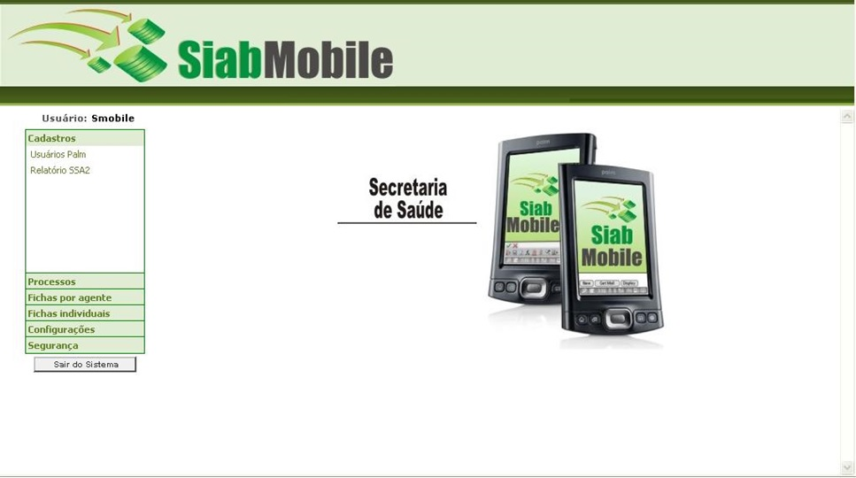
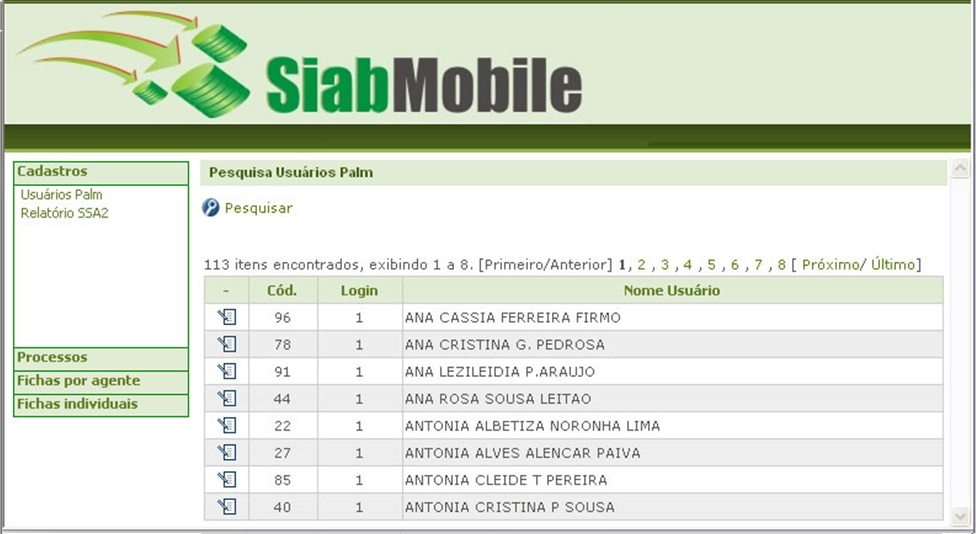
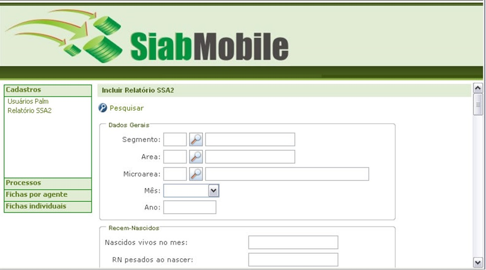
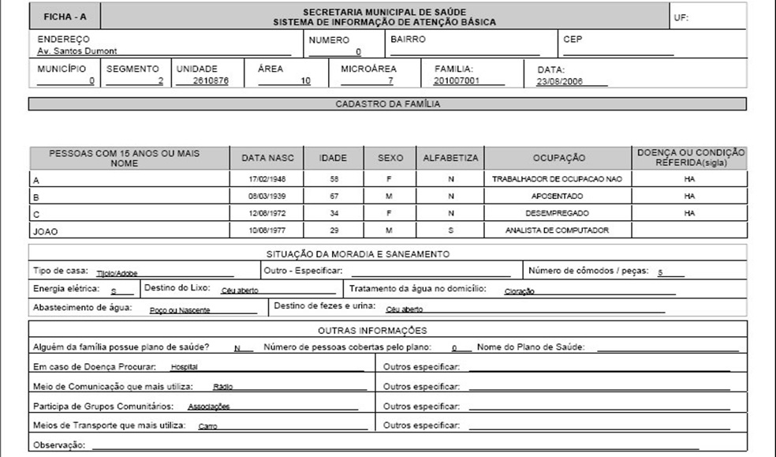

# Siab Web

The SIAB is a database (software), the goal is to store and process information about the Family Health strategy, leaving the professional teams of the Family Health strategize, set goals and identify interventions that are necessary in attention of the population and to evaluate the result of the work developed by the team.   

Technologies: Struts MVC, Apache Ant, JavaScript, html, Jsp, CSS, Java, Web Services (Apache Axis) and Postgress database;

 
 
 
 

